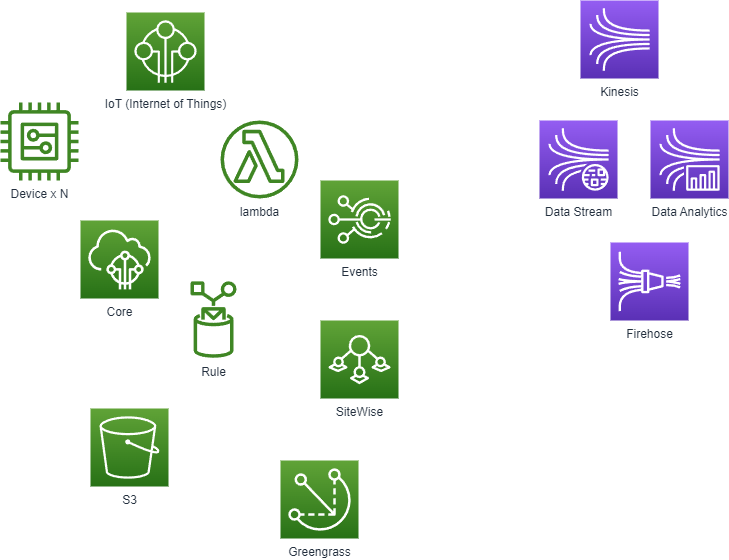

# AWS IoT 基本的な利用

基本的な利用方法をいくつか試してみる

## 1. S3 への保存

IoT Core で受信したメッセージを S3 に保存する例

## 2. リアルタイムでの監視

- Open Search (OpenSearch Dashboards)  
  \*ElasticSearch + Kibana のマネージドサービス
- Kinesis Analytics
- S3 + Athena

データのバッファリングと変換を効率的に行うため Kinesis Data Firehose を利用します。

## 3. 通知の基本

## 4. IoT SiteWise

産業機器データの収集、整理、分析を簡素化するマネージドサービス
